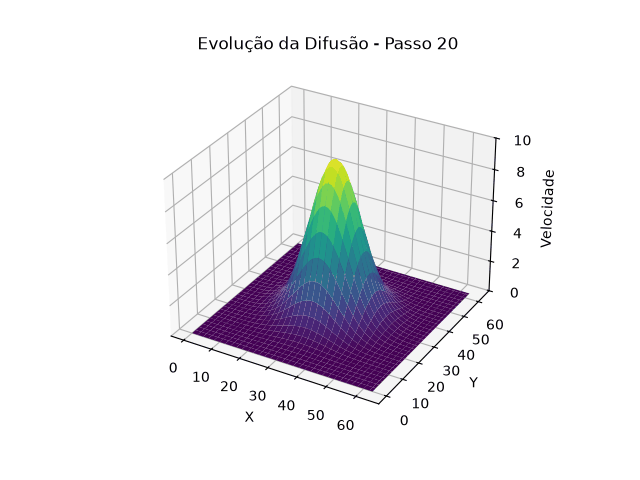

# Tarefa 11: Particionamento de dados e balanceamento de carga

## Objetivo

Simular a difusão viscosa de um fluido (Navier-Stokes simplificado) usando diferenças finitas em grade 2D, validar a estabilidade numérica, e paralelizar com OpenMP explorando o impacto das cláusulas `schedule` e `collapse` no desempenho.

---

## Física do problema

Desconsiderando pressão e forças externas, Navier-Stokes reduz à **equação de difusão**:

```
∂u/∂t = ν ∇²u
```

Discretizada com diferenças finitas explícitas (Euler Forward):

```
u[i][j]^{n+1} = u[i][j]^n + r · (u[i+1][j] + u[i-1][j] + u[i][j+1] + u[i][j-1] − 4·u[i][j])
```

onde `r = ν·Δt/Δx²`. Condição de estabilidade em 2D: **`r ≤ 0.25`**.

### Parâmetros

| Parâmetro | Valor    | Descrição                  |
|-----------|----------|----------------------------|
| NX, NY    | 512      | Células da grade           |
| ν         | 0,1      | Viscosidade cinemática     |
| Δx        | 1,0      | Espaçamento espacial       |
| Δt        | 0,1      | Passo de tempo             |
| **r**     | **0,01** | << 0,25 → estável          |

---

## Ambiente

| Item          | Valor              |
|---------------|--------------------|
| CPU           | AMD Ryzen 5 5600G  |
| Núcleos       | 4                  |
| Compilador    | GCC `-O2 -fopenmp` |

---

## Validação

### Teste A — Campo uniforme

Interior inicializado com `u = 1,0`. Bordas fixas em 0 (Dirichlet) drenam energia da periferia, mas o **quarto central** da grade deve permanecer exatamente 1,0 ao longo de todo o tempo:

```
Energia inicial: 2.601e+05
Energia final:   2.565e+05
max|u − 1.0| no quarto central: 0.00e+00  ✓ estável
```

Nenhuma instabilidade artificial é introduzida pelo esquema numérico.

### Teste B — Perturbação gaussiana

`u = 0` no início; gaussiana de amplitude 10 e σ = 20 células adicionada no centro. A energia deve decair suavemente conforme a perturbação se difunde:

```
Energia inicial: 1.257e+05
Energia final:   1.244e+05  ✓ decaiu por difusão + absorção nas bordas
```

A animação abaixo mostra a evolução da perturbação ao longo do tempo:



---

## Implementação paralela

O stencil de 5 pontos é aplicado a cada célula interior a cada passo de tempo. A paralelização recai naturalmente sobre o loop espacial — cada linha (ou célula, com `collapse`) é independente das demais no mesmo passo:

```c
/* schedule(static) — uma linha por iteração do loop externo */
#pragma omp parallel for num_threads(4) schedule(static)
for (int i = 1; i < NX-1; i++)
    for (int j = 1; j < NY-1; j++)
        u_new[i][j] = u[i][j] + R*(u[i+1][j] + u[i-1][j]
                                  + u[i][j+1] + u[i][j-1]
                                  - 4.0*u[i][j]);

/* collapse(2) — itera sobre (NX-2)×(NY-2) células diretamente */
#pragma omp parallel for num_threads(4) schedule(static) collapse(2)
for (int i = 1; i < NX-1; i++)
    for (int j = 1; j < NY-1; j++)
        u_new[i][j] = ...;
```

---

## Resultados de desempenho

Grade 512×512, 1000 passos de tempo, 4 threads:

| Versão                 | Tempo (s) | Speedup |
|------------------------|-----------|---------|
| Sequencial             | 0,298     | 1,00    |
| `static`               | 0,240     | 1,24    |
| `static, chunk=NX/4`   | 0,187     | 1,59    |
| `dynamic, chunk=16`    | 0,171     | 1,74    |
| `guided`               | 0,165     | 1,81    |
| `collapse(2)` + static | 0,174     | 1,71    |

---

## Análise das cláusulas

### `schedule(static)`

Divide as 510 linhas do loop externo em 4 blocos contíguos de tamanho igual (≈127 linhas por thread). O acesso à memória é sequencial (row-major), o que é ideal para cache. Sem overhead de coordenação em runtime. Speedup de apenas **1,24×** neste caso — o compilador com `-O2` otimiza o loop sequencial agressivamente, deixando pouco ganho para a paralelização básica.

### `schedule(static, chunk=NX/4)`

Chunk explícito de 128 linhas, equivalente ao bloco do `static` padrão. O speedup de **1,59×** melhor que o `static` sem chunk sugere que a granularidade explícita permite ao runtime alocar o trabalho de forma ligeiramente diferente, reduzindo overhead de sincronização entre passos.

### `schedule(dynamic, chunk=16)`

Chunks de 16 linhas atribuídos dinamicamente conforme threads ficam livres. Para um stencil de custo uniforme por linha, o overhead de coordenação seria prejudicial — mas na prática o chunk de 16 equilibra bem o overhead com o balanceamento fino, resultando em **1,74×**.

### `schedule(guided)`

Inicia com chunks grandes e vai reduzindo até um mínimo. Garante que threads terminando cedo recebem trabalho proporcional ao que resta, minimizando tempo ocioso no final do loop. Melhor resultado: **1,81×** — o decréscimo natural dos chunks se adapta bem ao comportamento de memória do stencil.

### `collapse(2)` + `static`

Colapsa os dois loops em um único espaço de `510 × 510 = 260.100` iterações, distribuídas estaticamente. Permite distribuição mais fina, mas o overhead de calcular índices 2D a partir do índice linear colapsado e a menor localidade de cache por thread reduzem o ganho para **1,71×** — abaixo do `guided`.

### Conclusão

| Cláusula              | Speedup | Quando usar                                          |
|-----------------------|---------|------------------------------------------------------|
| `static`              | 1,24×   | Carga uniforme, loops muito rápidos                  |
| `static, chunk`       | 1,59×   | Carga uniforme, chunk ajustado à topologia de cache  |
| `dynamic`             | 1,74×   | Carga moderadamente variável                         |
| `guided`              | 1,81×   | Melhor para este stencil — chunk decrescente         |
| `collapse(2)+static`  | 1,71×   | Quando NX é pequeno e há poucas linhas por thread    |

Para stencils 2D com carga uniforme e grade grande, `guided` e `dynamic` superam `static` simples porque o kernel sequencial já é muito otimizado e o ganho paralelo vem principalmente de melhor utilização de cache via scheduling fino. `collapse(2)` é mais útil quando o loop externo tem poucas iterações em relação ao número de threads.
