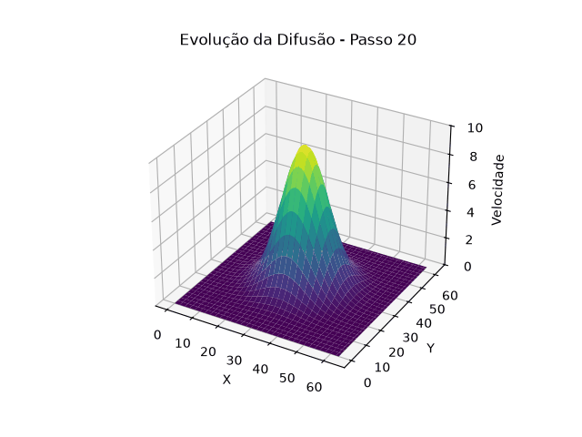

# Tarefa 11: Particionamento de dados e balanceamento de carga

## Objetivo

Simular a difusão viscosa de um fluido (Navier-Stokes simplificado) usando diferenças finitas em grade 2D, validar a estabilidade numérica, e paralelizar com OpenMP explorando o impacto das cláusulas `schedule` e `collapse` no desempenho.

---

## Física do problema

Desconsiderando pressão e forças externas, Navier-Stokes reduz à **equação de difusão**:

```
∂u/∂t = ν ∇²u
```

Discretizada com diferenças finitas explícitas (Euler Forward):

```
u[i][j]^{n+1} = u[i][j]^n + r · (u[i+1][j] + u[i-1][j] + u[i][j+1] + u[i][j-1] − 4·u[i][j])
```

onde `r = ν·Δt/Δx²`. Condição de estabilidade em 2D: **`r ≤ 0.25`**.

### Parâmetros

| Parâmetro | Valor    | Descrição                  |
|-----------|----------|----------------------------|
| NX, NY    | 512      | Células da grade           |
| ν         | 0,1      | Viscosidade cinemática     |
| Δx        | 1,0      | Espaçamento espacial       |
| Δt        | 0,1      | Passo de tempo             |
| **r**     | **0,01** | << 0,25 → estável          |

---

## Ambiente

| Item          | Valor              |
|---------------|--------------------|
| CPU           | AMD Ryzen 5 5600G  |
| Núcleos       | 4                  |
| Compilador    | GCC `-O2 -fopenmp` |

---

## Validação

Ambos os testes rodam 2000 passos (t = 200) na versão sequencial.

### Teste A — Campo uniforme

Interior inicializado com `u = 1,0`. Bordas fixas em 0 (Dirichlet) drenam a periferia, mas o **quarto central** da grade deve permanecer exatamente 1,0 ao longo de todo o tempo:

```
max|u − 1.0| no quarto central: 0.00e+00  ✓ estável
```

Nenhuma instabilidade artificial é introduzida pelo esquema numérico.

### Teste B — Perturbação gaussiana

`u = 0` no início; gaussiana de amplitude 10 e σ₀ = 5 células no centro. Uma difusão correta tem assinatura analítica conhecida: o pico cai, a massa `Σu` se conserva (a perturbação não alcança as bordas) e a largura cresce segundo `σ(t) = √(σ₀² + 2νt)`.

```
pico:     10.0000 →   3.8546   (deve cair)
largura:   5.0000 →   8.0623   (analítico: 8.0623)  ✓
massa Σu: 1.570796e+03 → 1.570796e+03               ✓ conservada
mínimo final: 0.00e+00  (≥ 0 → difusão suave, sem oscilação)
```

A largura medida bate com a solução analítica em quatro casas decimais — isso valida o esquema numérico, e não apenas a ausência de divergência. O mínimo não-negativo confirma que a difusão é suave, sem oscilações espúrias.

A animação abaixo mostra a evolução da perturbação ao longo do tempo:



---

## Implementação paralela

O stencil de 5 pontos é aplicado a cada célula interior a cada passo de tempo. A paralelização recai naturalmente sobre o loop espacial — cada linha (ou célula, com `collapse`) é independente das demais no mesmo passo:

```c
/* schedule(runtime): a política vem de omp_set_schedule(), o que permite
   comparar static/dynamic/guided com um único corpo de código. */
#pragma omp parallel for schedule(runtime)
for (int i = 1; i < NX-1; i++)
    atualiza_linha(u, u_new, i);

/* collapse(2) — itera sobre (NX-2)×(NY-2) células diretamente */
#pragma omp parallel for schedule(runtime) collapse(2)
for (int i = 1; i < NX-1; i++)
    for (int j = 1; j < NY-1; j++)
        u_new[i][j] = u[i][j] + R*(u[i+1][j] + u[i-1][j]
                                  + u[i][j+1] + u[i][j-1]
                                  - 4.0*u[i][j]);
```

Os dois grids usam **double buffering**: ao fim de cada passo os ponteiros `u` e `u_new` são trocados, em vez de copiar a grade. Uma versão anterior fazia `memcpy` de 2 MB por passo — trabalho serial do mesmo custo de banda que o próprio stencil, que por Amdahl limitava o speedup a ~1,5× com 4 threads.

O número de threads vem de `OMP_NUM_THREADS`, sem `num_threads` fixo no código:

```
make && OMP_NUM_THREADS=4 ./fluid
```

---

## Resultados de desempenho

Grade 512×512, 1000 passos de tempo, 4 threads, mediana de 3 execuções:

| Versão                 | Tempo (s) | Speedup |
|------------------------|-----------|---------|
| Sequencial             | 0,226     | 1,00    |
| `static`               | 0,110     | 2,05    |
| `static, chunk=32`     | 0,080     | 2,82    |
| `dynamic, chunk=16`    | 0,089     | 2,53    |
| `guided`               | 0,076     | 2,96    |
| `collapse(2)` + static | 0,117     | 1,93    |

Entre execuções, os três schedules de granularidade fina (`static+chunk`, `dynamic`, `guided`) oscilam na faixa de **2,5× a 3,1×** e trocam de posição entre si — a diferença entre eles está dentro do ruído de medição. O que se mantém consistente é a separação em dois grupos: eles ficam acima, `static` puro e `collapse(2)` ficam abaixo.

---

## Análise das cláusulas

### `schedule(static)`

Divide as 510 linhas do loop externo em 4 blocos contíguos iguais (≈127 linhas por thread). O acesso é sequencial em row-major, ideal para cache, e não há coordenação em runtime. Ainda assim fica em **~2,0×**: o kernel é *memory-bound* (lê 5 valores e escreve 1 por célula, com pouquíssima aritmética), então o gargalo é a banda de memória, não a CPU — quatro threads não entregam 4× porque disputam o mesmo controlador.

### `schedule(static, chunk=32)`

Chunks de 32 linhas distribuídos ciclicamente (round-robin) entre as threads. O intercalamento faz com que as threads percorram regiões mais próximas da memória ao mesmo tempo, melhorando o reúso de cache compartilhado e o *prefetch*: **~2,8×**.

### `schedule(dynamic, chunk=16)`

Chunks de 16 linhas atribuídos conforme as threads ficam livres. Para um stencil de custo uniforme por linha, o balanceamento dinâmico não tem nada a corrigir e o overhead de coordenação seria puro custo — o ganho observado (**~2,5×**) vem do mesmo efeito de localidade do chunk pequeno, não do balanceamento.

### `schedule(guided)`

Começa com chunks grandes e vai reduzindo. Atinge **~3,0×**, mas pelo mesmo motivo dos anteriores: o efeito é de granularidade/cache, não de balanceamento de carga. Numa carga genuinamente irregular a vantagem do `guided` seria estrutural; aqui ele empata com os demais chunks finos dentro do ruído.

### `collapse(2)` + `static`

Colapsa os dois loops num espaço único de `510 × 510 = 260.100` iterações. Fica em **~1,9×**, o pior resultado paralelo: o loop interno deixa de ser um laço contíguo simples e passa a exigir a reconstrução dos índices `i` e `j` a partir do índice linear, o que atrapalha a vetorização e o prefetch. Com 510 linhas para 4 threads já há paralelismo de sobra no loop externo — `collapse` não acrescenta nada e só cobra o custo.

### Conclusão

| Cláusula              | Speedup | Quando usar                                            |
|-----------------------|---------|--------------------------------------------------------|
| `static`              | ~2,0×   | Carga uniforme; menor overhead, mas chunks grandes      |
| `static, chunk`       | ~2,8×   | Carga uniforme, chunk ajustado à topologia de cache     |
| `dynamic`             | ~2,5×   | Carga variável — aqui o ganho não vem do balanceamento  |
| `guided`              | ~3,0×   | Carga variável com cauda longa de iterações             |
| `collapse(2)+static`  | ~1,9×   | Quando o loop externo tem poucas iterações para as threads |

A lição do experimento é que **a carga já é perfeitamente uniforme**: cada linha custa o mesmo, então `dynamic` e `guided` não têm desbalanceamento para corrigir e o que os separa do `static` puro é o tamanho do chunk, não a política. O teto de ~3× com 4 threads é da banda de memória, não do escalonamento. `collapse(2)` só compensa quando o loop externo tem menos iterações que threads disponíveis — o oposto do caso aqui.
