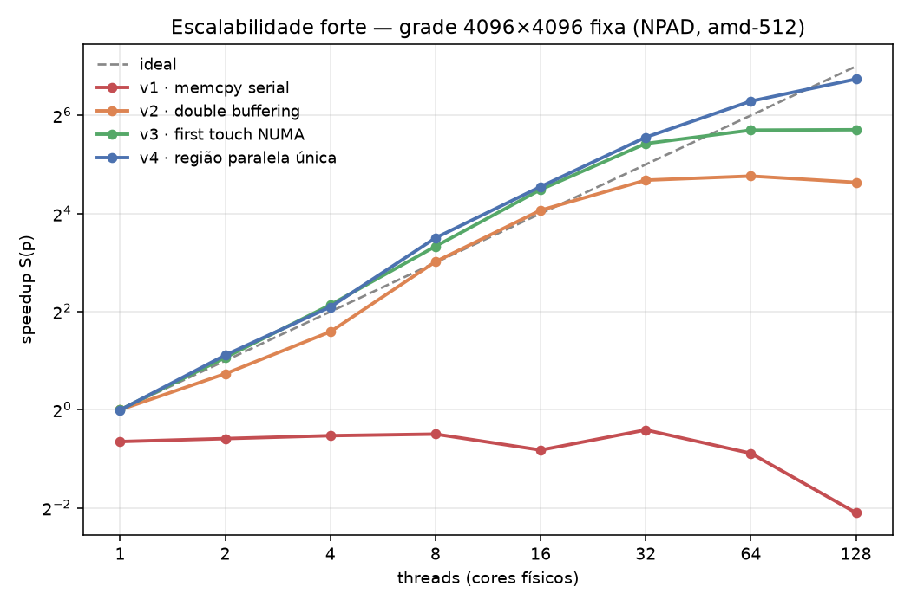
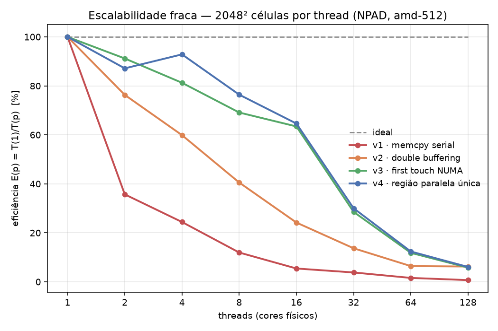
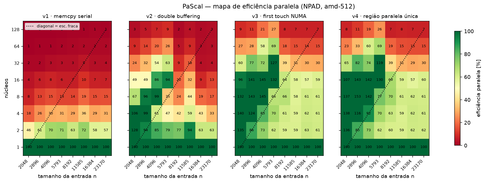
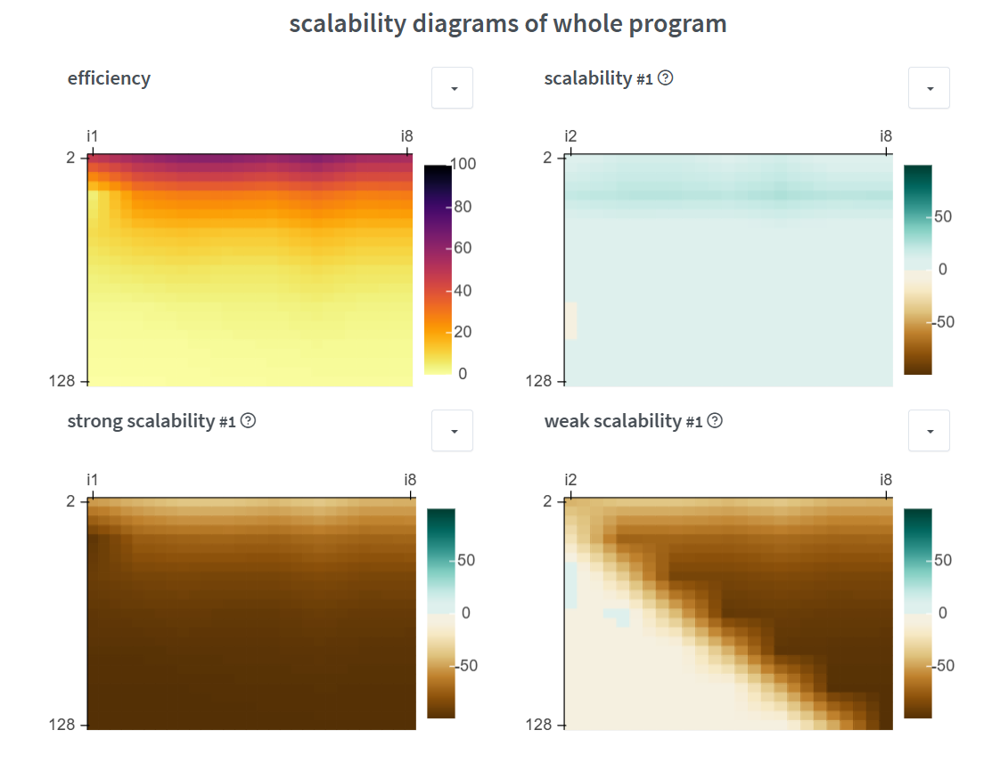
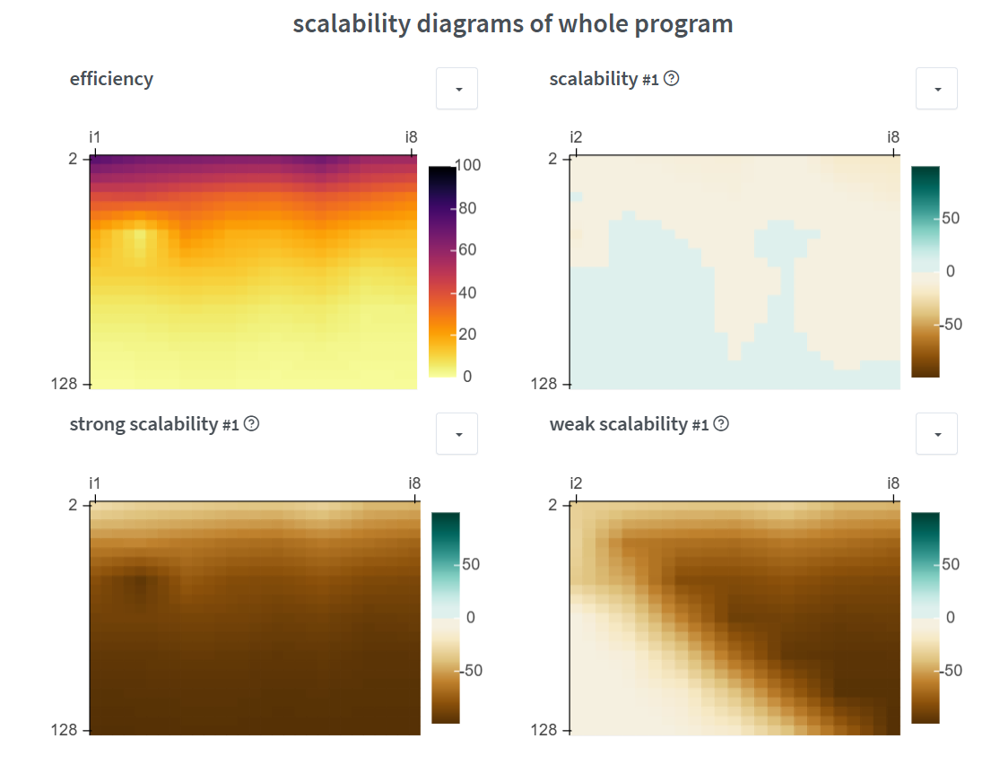
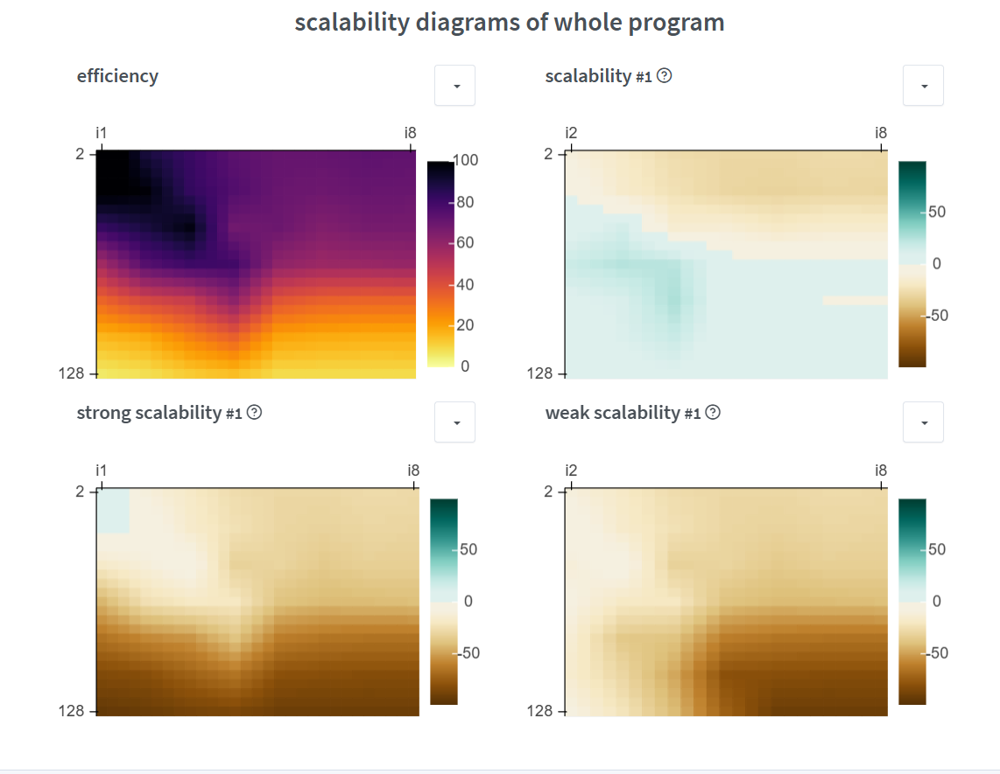
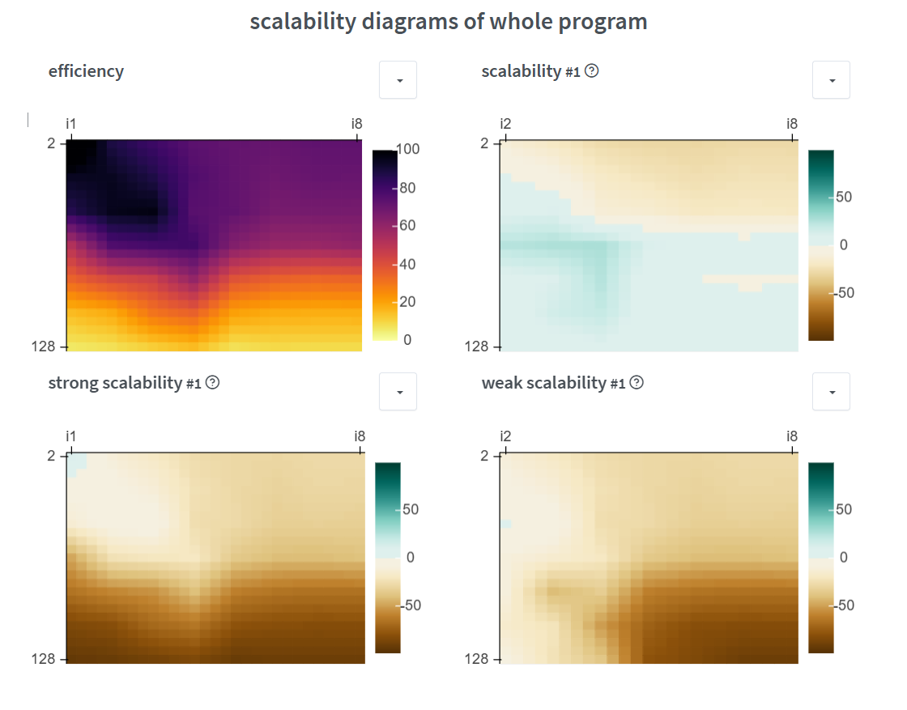

# Tarefa 12: Desempenho vs. Escalabilidade

## Objetivo

Avaliar a escalabilidade do código de Navier-Stokes em um nó de computação do NPAD, identificar os gargalos de escalabilidade e reportar o progresso em versões sucessivas do código otimizado, comentando escalabilidade, escalabilidade fraca e escalabilidade forte.

---

## Ambiente de execução

Medições feitas em um nó da partição `amd-512` do supercomputador do NPAD (`r2n21`), com reserva exclusiva do nó.

| Item              | Valor                                     |
|-------------------|-------------------------------------------|
| Processador       | 2× AMD EPYC 7713 (Milan), 64 cores cada   |
| Cores físicos     | 128 (256 threads de hardware, SMT desligado via `--hint=compute_bound`) |
| Domínios NUMA     | 8 (16 cores cada)                         |
| Memória           | 512 GB, DDR4-3200, 8 canais por socket (~409 GB/s de pico teórico) |
| Cache L3 agregado | 256 MB por socket, **512 MB no nó**       |
| Compilador        | GCC 14.2.0, `-O3 -march=native -fopenmp`  |
| Afinidade         | `OMP_PLACES=cores`, `OMP_PROC_BIND=spread`|

```bash
sbatch job_escalabilidade.sh     # sweep próprio (~15 min)
python3 analise.py               # tabelas + gráficos

sbatch job_pascal.sh             # sweep com o PaScal Analyzer (~1h07)
python3 pascal_analise.py        # tabelas + mapa de eficiência
```

A reserva exclusiva (`--exclusive`) não é detalhe de conforto: medir escalabilidade em nó compartilhado mistura o comportamento do código com a disputa de banda de memória de outros jobs, e a banda é justamente a grandeza sob investigação aqui.

---

## O que se mede

Seguindo as definições do material da disciplina:

- **Desempenho = 1/Tempo.** Quão rápido o problema é resolvido.
- **Eficiência = Trabalho / (Tempo × Recursos).** Quanto de cada núcleo é convertido em trabalho útil.
- **Escalabilidade forte:** problema *fixo*, recursos crescentes. Mantém eficiência sem aumentar o problema?
- **Escalabilidade fraca:** trabalho *por thread* fixo — problema e recursos crescem juntos. O tempo deveria permanecer constante.

Como o problema muda de tamanho na escalabilidade fraca, o tempo bruto deixa de ser comparável; por isso as tabelas também trazem **MLUPS** (milhões de células atualizadas por segundo), a taxa de trabalho útil, que é comparável entre tamanhos.

---

## Versões do código

Cinco versões do mesmo cálculo, cada uma removendo um gargalo da anterior. Todas estão em [fluid_scale.c](fluid_scale.c), selecionadas por argumento de linha de comando.

| Versão | O que muda | Gargalo que remove |
|--------|------------|--------------------|
| `v0-sequencial`   | referência de 1 thread                    | — |
| `v1-memcpy`       | `omp parallel for` + `memcpy` do grid por passo | — (é a versão ingênua) |
| `v2-doublebuf`    | troca de ponteiros no lugar da cópia      | trecho serial (Amdahl) |
| `v3-firsttouch`   | inicialização paralela com a mesma partição do cálculo | localidade NUMA |
| `v4-regiao-unica` | um só `omp parallel` envolve o laço do tempo | fork/join por passo |

O núcleo numérico é o da Tarefa 11 — difusão viscosa `∂u/∂t = ν∇²u`, stencil de 5 pontos, Euler explícito, `r = ν·Δt/Δx² = 0,01 ≪ 0,25` — agora com grade dimensionada em tempo de execução, o que é pré-requisito para escalabilidade fraca.

### Validação

Otimização que muda o resultado não é otimização. O modo `valida` roda as cinco versões e compara o campo final:

```
Validação — grade 1024×1024, 200 passos, 128 threads

versão                     checksum Σu          pico
v0-sequencial         1.570796326795e+03      8.630114  (referência)
v1-memcpy             1.570796326795e+03      8.630114  ✓ idêntico
v2-doublebuf          1.570796326795e+03      8.630114  ✓ idêntico
v3-firsttouch         1.570796326795e+03      8.630114  ✓ idêntico
v4-regiao-unica       1.570796326795e+03      8.630114  ✓ idêntico

massa Σu analítica (2πσ₀²A): 1.570796e+03
massa Σu medida:             1.570796e+03   (deve se conservar)
```

Os checksums coincidem **bit a bit**, o que era esperado: o stencil é determinístico por célula e não há redução em ponto flutuante, então a ordem das threads não altera o resultado. A massa medida bate com a integral analítica da gaussiana `2πσ₀²A`, confirmando que a física continua correta com 128 threads.

---

## Escalabilidade forte

Grade fixa de **4096×4096** (134 MB por grid), 100 passos, mediana de 3 execuções.

### Tempo (s)

| threads | v1 · memcpy | v2 · double buf | v3 · first touch | v4 · região única |
|---|---|---|---|---|
| 1 | 1,834 | 1,171 | 1,171 | 1,175 |
| 2 | 1,759 | 0,704 | 0,560 | 0,541 |
| 4 | 1,688 | 0,389 | 0,266 | 0,274 |
| 8 | 1,652 | 0,144 | 0,116 | 0,103 |
| 16 | 2,068 | 0,070 | 0,052 | 0,050 |
| 32 | 1,557 | 0,046 | 0,027 | 0,025 |
| 64 | 2,166 | 0,043 | 0,023 | **0,015** |
| 128 | 5,018 | 0,047 | 0,022 | **0,011** |

Referência sequencial (v0): **1,171 s** (1432 MLUPS).

### Speedup S(p) = T(sequencial) / T(p)

| threads | v1 | v2 | v3 | v4 | ideal |
|---|---|---|---|---|---|
| 1 | 0,6× | 1,0× | 1,0× | 1,0× | 1× |
| 2 | 0,7× | 1,7× | 2,1× | 2,2× | 2× |
| 4 | 0,7× | 3,0× | 4,4× | 4,3× | 4× |
| 8 | 0,7× | 8,1× | 10,1× | 11,3× | 8× |
| 16 | 0,6× | 16,8× | 22,4× | 23,4× | 16× |
| 32 | 0,8× | 25,6× | 43,0× | 47,0× | 32× |
| 64 | 0,5× | 27,2× | 52,0× | 78,3× | 64× |
| 128 | 0,2× | 24,9× | 52,3× | **106,9×** | 128× |

### Eficiência E(p) = S(p)/p

| threads | v1 | v2 | v3 | v4 |
|---|---|---|---|---|
| 1 | 64% | 100% | 100% | 100% |
| 2 | 33% | 83% | 105% | 108% |
| 4 | 17% | 75% | 110% | 107% |
| 8 | 9% | 101% | 126% | 142% |
| 16 | 4% | 105% | 140% | 146% |
| 32 | 2% | 80% | 134% | 147% |
| 64 | 1% | 42% | 81% | 122% |
| 128 | 0% | 19% | 41% | 84% |



---

## Os três gargalos, um a um

### 1. Trecho serial — Amdahl (v1 → v2)

A v1 calcula o grid novo em paralelo e depois copia tudo de volta com `memcpy`. Essa cópia move exatamente a mesma quantidade de bytes que o próprio stencil: **cerca de metade do trabalho ficou serial**. Pela lei de Amdahl, com `f = 0,5` o speedup satura em 2× por mais núcleos que se acrescente.

A medição é ainda pior que a previsão: a v1 **nunca ultrapassa 0,8×** — ou seja, é mais lenta que o código sequencial em qualquer número de threads, e com 128 threads chega a **5,0 s contra 1,17 s da sequencial (0,2×)**. O motivo é que a previsão de Amdahl supõe overhead zero: aqui, abrir e fechar um time de 128 threads a cada um dos 100 passos, para um trecho paralelo que já não domina, custa mais do que o paralelismo rende. Um trecho serial não apenas limita o ganho — em escala suficiente, ele o inverte.

A correção é a mais barata das quatro: em vez de copiar 134 MB, trocam-se dois ponteiros. Não se otimizou o trecho serial, **eliminou-se** o trecho serial. A v2 sai de 0,7× para 16,8× em 16 threads.

### 2. Localidade NUMA — first touch (v2 → v3)

A v2 escala bem até 16 threads e então empaca: 16,8× → 25,6× → 27,2× → 24,9×. A partir de 32 threads a eficiência despenca de 105% para 19%.

A causa está fora do laço de cálculo. No Linux a página física só é escolhida no **primeiro acesso**, e ela nasce na memória do domínio NUMA da thread que a tocou. A v2 aloca e zera os grids na thread mestre, então os 268 MB inteiros ficam em **um** dos 8 domínios NUMA do nó. Enquanto as threads cabem nesse domínio, tudo bem; quando o time se espalha pelos dois sockets, 7/8 dos acessos viram tráfego remoto pelo Infinity Fabric, e o controlador de memória de um único domínio vira o gargalo de toda a máquina.

A v3 não muda uma linha do stencil. Muda apenas quem toca a memória primeiro:

```c
#pragma omp parallel for schedule(static)
for (size_t i = 0; i < n; i++)
    memset(&g[i * n], 0, n * sizeof *g);
```

A partição `static` da inicialização é *a mesma* do laço de cálculo, então a thread que vai atualizar a linha `i` é a que instancia as páginas da linha `i`. Com 128 threads isso **dobra** o resultado: 24,9× → 52,3×. É o gargalo mais barato de corrigir e o mais fácil de não enxergar, porque não está no código que se está medindo.

### 3. Fork/join por passo — região paralela única (v3 → v4)

A v3 satura em ~52× a partir de 64 threads. A v4 abre uma única região paralela em torno de *todo* o laço do tempo, e cada thread deduz os buffers pela paridade do passo — a barreira implícita do `omp for` passa a ser o único ponto de sincronização:

```c
#pragma omp parallel
{
    for (int t = 0; t < nt; t++) {
        const double *src = (t % 2 == 0) ? u  : un;
        double       *dst = (t % 2 == 0) ? un : u;
        #pragma omp for schedule(static)
        for (size_t i = 1; i < n - 1; i++) linha(src, dst, i, n);
    }
}
```

A diferença de tempo por passo entre v3 e v4 isola o custo do fork/join:

| threads | 16 | 32 | 64 | 128 |
|---|---|---|---|---|
| (T_v3 − T_v4)/passo | 21 µs | 23 µs | 76 µs | **114 µs** |

O custo **cresce com o número de threads**, como se espera de uma operação que precisa acordar e recolher p threads. Com 128 threads o passo da v3 leva 224 µs e o da v4, 110 µs: **metade do tempo da v3 era fork/join, não cálculo**. Daí o salto de 52,3× para 106,9×.

Esse é o gargalo de escalabilidade mais insidioso dos três, porque seu peso é *absoluto* (dezenas de microssegundos por passo) e não proporcional ao trabalho. Ele é invisível num grid grande com poucas threads e domina num grid pequeno com muitas — exatamente a direção para a qual a escalabilidade forte empurra.

---

## Sobre a eficiência acima de 100%

As tabelas mostram eficiência de até **147%**, o que parece impossível: 32 threads não podem fazer o trabalho de 47. A explicação não é boa notícia sobre o código, e sim um artefato do tamanho do problema.

O conjunto de trabalho da escalabilidade forte são dois grids de 4096², isto é **268 MB**. Uma thread sozinha enxerga o L3 do seu próprio CCD (32 MB) e lê tudo da DRAM. Espalhadas pelo nó, 128 threads enxergam os **512 MB de L3 agregado** — e o problema inteiro passa a caber em cache. O speedup superlinear mede a transição de DRAM para cache, não uma propriedade do paralelismo.

Isso é a distinção do enunciado em estado puro: a v4 tem **desempenho** excelente nesse ponto (0,011 s), mas a **eficiência** de 84% com 128 threads está contaminada por uma mudança de regime de memória que não se repetiria num problema maior. Para saber o que a máquina realmente sustenta, é preciso olhar a escalabilidade fraca — onde o problema cresce junto com os recursos e nunca cabe em cache.

---

## Escalabilidade fraca

Trabalho por thread constante: **2048² células por thread**, ou seja `n = 2048·√p`. 50 passos, mediana de 3 execuções.

### Tempo (s) — o ideal é uma linha horizontal

| threads | grade | v1 | v2 | v3 | v4 |
|---|---|---|---|---|---|
| 1 | 2048² | 0,176 | 0,129 | 0,117 | 0,123 |
| 2 | 2896² | 0,494 | 0,169 | 0,128 | 0,141 |
| 4 | 4096² | 0,722 | 0,215 | 0,144 | 0,132 |
| 8 | 5793² | 1,474 | 0,318 | 0,170 | 0,160 |
| 16 | 8192² | 3,240 | 0,532 | 0,185 | 0,190 |
| 32 | 11585² | 4,622 | 0,940 | 0,410 | 0,408 |
| 64 | 16384² | 11,044 | 2,006 | 0,990 | 0,990 |
| 128 | 23170² | 25,252 | 2,062 | 2,022 | 2,019 |

### Eficiência E(p) = T(1)/T(p)

| threads | v1 | v2 | v3 | v4 |
|---|---|---|---|---|
| 1 | 100% | 100% | 100% | 100% |
| 2 | 36% | 76% | 91% | 87% |
| 4 | 24% | 60% | 81% | 93% |
| 8 | 12% | 41% | 69% | 76% |
| 16 | 5% | 24% | 63% | 65% |
| 32 | 4% | 14% | 29% | 30% |
| 64 | 2% | 6% | 12% | 12% |
| 128 | 1% | 6% | 6% | 6% |

### Vazão (MLUPS) — o trabalho útil por segundo

| threads | v1 | v2 | v3 | v4 |
|---|---|---|---|---|
| 1 | 1187 | 1625 | 1786 | 1709 |
| 2 | 848 | 2481 | 3259 | 2979 |
| 4 | 1161 | 3896 | 5812 | 6352 |
| 8 | 1137 | 5278 | 9892 | 10460 |
| 16 | 1035 | 6300 | **18157** | 17689 |
| 32 | 1451 | 7133 | 16346 | 16437 |
| 64 | 1215 | 6688 | 13554 | 13557 |
| 128 | 1063 | 13013 | 13276 | **13294** |



---

## Análise da escalabilidade fraca

A leitura honesta é que **o código não é fracamente escalável**: com 128 threads e 128× o problema, a eficiência da melhor versão cai a 6%. Mas o motivo não é o código — é a máquina, e a tabela de MLUPS mostra por quê.

A vazão cresce quase linearmente até 16 threads (1786 → 18157 MLUPS, ou seja 10× com 16× os recursos) e então **para e recua**, estabilizando em ~13300 MLUPS de 64 threads em diante. Esse patamar é o teto de banda de memória do nó. O stencil movimenta aproximadamente 16 bytes por célula atualizada (uma linha nova lida, uma escrita; as demais leituras vêm do cache), o que coloca o patamar em **~210 GB/s** — cerca de metade do pico teórico de 409 GB/s do nó, número típico para um acesso de streaming real.

Um único core já entrega ~1700 MLUPS (~27 GB/s). O nó inteiro entrega ~13300. **A razão é 8×, não 128×.** Esse é o veredito: num kernel memory-bound, o recurso que escala é a banda de memória, e ela cresce muito mais devagar que a contagem de núcleos. Nenhuma otimização de código atravessa esse teto — só mudaria o algoritmo (*temporal blocking*, que funde vários passos de tempo sobre um bloco que cabe em cache, trocando banda por recomputação).

Três observações adicionais:

- **O pico em 16 threads (18157 MLUPS) não é o teto real.** Com 16 threads a grade é 8192² e ainda há reúso residual de cache entre linhas vizinhas de threads adjacentes. À medida que o problema cresce, esse reúso desaparece e a vazão converge para o valor sustentado por DRAM.
- **v2 alcança v3 e v4 em 128 threads** (2,06 vs 2,02 s), depois de ficar 2× atrás em 64 threads. A leitura mais plausível é que, no teto de banda, a penalidade de acesso remoto deixa de aparecer: com todos os controladores saturados, a fila de memória domina e a origem da página importa menos. É uma interpretação, não uma medição — confirmá-la exigiria contadores de hardware (`perf` com eventos de NUMA) fora do escopo desta tarefa.
- **v4 empata com v3 na escalabilidade fraca**, ao contrário da escalabilidade forte, onde ganhava 2×. Coerente com o diagnóstico: o fork/join custa ~114 µs por passo, irrelevante diante dos 40 ms por passo deste problema, mas decisivo nos 110 µs por passo do problema fixo. **O mesmo gargalo pesa de formas opostas nos dois regimes** — e é por isso que as duas análises precisam ser feitas.

---

## Validação cruzada com o PaScal Suite

Tudo acima foi medido com um sweep próprio. Como a mesma avaliação pode ser feita com o **PaScal Analyzer** (LAPPS/IMD-UFRN), a ferramenta da própria casa para esse tipo de estudo, o experimento foi repetido por ela — o que dá duas coisas: um instrumento independente para confrontar os números, e o JSON que o **PaScal Viewer** consome.

O binário instrumentado ([pascal_fluid.c](pascal_fluid.c)) usa o mesmo núcleo numérico ([stencil.h](stencil.h)), com duas regiões marcadas:

```c
pascal_start(1);  /* inicialização: alocação, first touch, condição inicial */
pascal_start(2);  /* cálculo: o laço do tempo */
```

Rodado com o produto cartesiano de 8 contagens de núcleos × 8 tamanhos × 3 repetições, por versão ([job_pascal.sh](job_pascal.sh), 1h07 de nó exclusivo):

```bash
pascalanalyzer ./pascal_fluid_v4 --inst man \
    --cors 1,2,4,8,16,32,64,128 \
    --ipts "2048","2896","4096","5793","8192","11585","16384","23170" \
    --rpts 3 --outp pascal_v4.json
```

Os tamanhos são `n = 2048·√p`, casados às contagens de núcleos. Com isso **cada linha do mapa é uma escalabilidade forte** e **a diagonal é exatamente a escalabilidade fraca** — com um ladder geométrico qualquer o mapa sai igual, mas a diagonal não significa nada.



### As duas medições concordam

| medida (n=2048, 1 núcleo, região de cálculo) | sweep próprio | PaScal |
|---|---|---|
| v1 · memcpy serial | 0,1763 s | 0,1763 s |
| v2 · double buffering | 0,1288 s | 0,1289 s |
| v4 · região única | 0,1225 s | 0,1242 s |

E a diagonal do PaScal reproduz a conclusão da escalabilidade fraca: vazão subindo até 16 núcleos, platô em ~13000 MLUPS e eficiência de 6% em 128 núcleos.

| núcleos | 1 | 2 | 4 | 8 | 16 | 32 | 64 | 128 |
|---|---|---|---|---|---|---|---|---|
| v4 · MLUPS na diagonal | 1685 | 2639 | 5271 | 9323 | 16510 | 14691 | 12789 | 12936 |
| v4 · eficiência fraca | 100% | 78% | 78% | 69% | 61% | 27% | 12% | **6%** |

Dois instrumentos independentes chegando ao mesmo teto é o que permite atribuí-lo à máquina, e não ao método de medição.

### O que só as regiões mostram

Separar inicialização de cálculo revelou o efeito mais direto de todo o trabalho. Tempo da **região 1** com o maior problema (n=23170²):

| núcleos | v1 · memcpy | v2 · double buf | v3 · first touch | v4 · região única |
|---|---|---|---|---|
| 1 | 13,73 s | 13,72 s | 14,14 s | 14,15 s |
| 8 | 13,72 s | 13,72 s | 1,82 s | 1,83 s |
| 32 | 13,73 s | 13,73 s | 0,48 s | 0,48 s |
| 128 | 13,72 s | 13,73 s | **0,19 s** | **0,19 s** |

A inicialização de v1 e v2 custa **13,7 s em qualquer número de núcleos** — é serial por construção, e é exatamente aí que todas as páginas do grid nascem em um único domínio NUMA. Em v3/v4 ela cai de 14,15 s para 0,19 s (**74×**).

Isso responde a uma objeção que as tabelas de tempo de cálculo sozinhas não respondem: *o ganho da v3 foi real ou apenas empurrado para fora da região medida?* Foi real — a região 1 não só não engordou, como encolheu 74×. A mudança de first touch é rara nesse sentido: acelera as duas regiões de uma vez, porque paralelizar a inicialização é o próprio mecanismo que distribui as páginas.

### Onde as duas medições divergem

A v2 tem, no mapa do PaScal, um comportamento mais irregular e pior em muitos núcleos do que no sweep próprio — 2695 MLUPS contra 6688 com 64 núcleos, e células vizinhas do mapa saltando de 99% para 24%.

A explicação mais provável é a política de posicionamento. O sweep próprio fixa `OMP_PROC_BIND=spread` + `OMP_PLACES=cores`; o PaScal Analyzer habilita e desabilita CPUs por conta própria, e fixar afinidade por fora entraria em conflito com ele, então nada foi exportado no job do PaScal. Como a v2 é justamente a versão cujo desempenho **depende** de onde as páginas caíram em relação aos núcleos ativos, ela é a mais sensível a essa diferença — v1 (limitada pelo trecho serial) e v3/v4 (com páginas locais por construção) mostram os dois métodos em acordo muito melhor.

É uma interpretação coerente com o resto dos dados, não uma medição: confirmá-la exigiria variar a política de afinidade explicitamente e observar a v2 mudar de comportamento.

### No PaScal Viewer

Os quatro JSONs ([pascal_v1.json](pascal_v1.json) … [pascal_v4.json](pascal_v4.json)) carregam direto em https://pascalsuite.imd.ufrn.br/pascal-viewer/ pelo botão *Choose file*. Os diagramas abaixo são do próprio Viewer, um por versão — eixo vertical de 2 a 128 núcleos (de cima para baixo), eixo horizontal `i1`…`i8` correspondendo aos oito tamanhos em ordem crescente (2048 … 23170).

| v1 · memcpy serial | v2 · double buffering |
|---|---|
|  |  |

| v3 · first touch NUMA | v4 · região paralela única |
|---|---|
|  |  |

**A progressão aparece como cor.** O painel de eficiência vai de quase inteiramente amarelo na v1 (eficiência perto de zero em quase todo o espaço de configurações) a majoritariamente escuro na v3 e na v4. É a mesma história das tabelas, lida de uma vez só.

**A v3 e a v4 são quase indistinguíveis aqui**, o que confirma o resultado da diagonal: o ganho da região paralela única aparece quando o passo de tempo é curto em relação ao custo de fork/join, e nesses tamanhos de problema a inicialização e o cálculo dominam.

**O Viewer confirma a correção do mapeamento de entradas.** Nos mapas da v3 e da v4, a região de alta eficiência fica à esquerda (`i1`–`i4`, os menores `n`) — exatamente onde as tabelas mostram os 135–145% de eficiência superlinear por residência em cache. Se o índice estivesse associado ao tamanho errado, essa região apareceria espalhada sem padrão.

### Por que o Viewer é mais severo que as tabelas acima

Os diagramas dizem **"whole program"**: medem o processo inteiro, incluindo a região 1. As tabelas desta seção usam só a região 2 (o cálculo).

A diferença não é conflito, é escopo — e ela é instrutiva justamente na v1 e na v2, cuja inicialização custa 13,7 s serial em qualquer número de núcleos. No recorte do cálculo, a v2 ainda mostra eficiência razoável com poucos núcleos; no programa inteiro, esse trecho serial fixo afunda a eficiência global. É a lei de Amdahl aplicada ao programa como um usuário o executaria, e não ao laço que o programador escolheu olhar.

Os dois recortes têm uso: o do cálculo isola o efeito de cada otimização no laço; o do programa inteiro diz quanto disso o usuário final realmente recebe.

Uma ressalva de leitura: os painéis `scalability #1`, `strong scalability #1` e `weak scalability #1` usam a normalização própria do Viewer (escala divergente de −50 a +50), que não foi reproduzida aqui. A comparação quantitativa entre versões nesta seção se apoia nas tabelas, extraídas diretamente dos JSONs por [pascal_analise.py](pascal_analise.py); os diagramas entram como leitura qualitativa do espaço de configurações.

## Conclusão: escalável, fraca ou fortemente escalável?

Aplicando as definições do material à melhor versão (v4):

**É escalável?** **Sim.** A perda de eficiência causada pelo aumento de recursos pode ser compensada pelo aumento do problema — de 1 para 128 threads, a vazão sustentada sobe de 1,7 para 13,3 GLUPS. O código aproveita mais máquina com mais problema, que é a definição.

**É fracamente escalável?** **Não** — e nenhum código deste tipo poderia ser, neste hardware. Manter a eficiência com o problema crescendo junto com os recursos exigiria que a banda de memória crescesse proporcionalmente aos núcleos, e no EPYC 7713 ela cresce ~8× enquanto os núcleos crescem 128×. O limite é arquitetural, não de implementação.

**É fortemente escalável?** **Na faixa medida, sim, e notavelmente**: 106,9× com 128 threads (84% de eficiência) sem aumentar o problema. Mas com a ressalva da seção sobre eficiência superlinear — parte desse resultado vem de a grade de 4096² passar a caber nos 512 MB de L3 agregado do nó. É um ganho real para *este* tamanho de problema, e não uma propriedade que se estenda a problemas maiores.

### Progressão em uma linha

| Versão | Speedup em 128 threads | Gargalo removido |
|--------|------------------------|------------------|
| v1 · memcpy serial       | 0,2×   | — |
| v2 · double buffering    | 24,9×  | trecho serial (Amdahl) |
| v3 · first touch NUMA    | 52,3×  | localidade de memória |
| v4 · região única        | 106,9× | fork/join por passo |
| *teto restante*          | —      | banda de memória (exigiria mudar o algoritmo) |

A lição que atravessa as quatro versões é a do enunciado: **desempenho e escalabilidade são grandezas diferentes**. A v1 com 128 threads tem péssimo desempenho *e* péssima escalabilidade. A v4 na escalabilidade forte tem ótimo desempenho e ótima eficiência aparente — mas a escalabilidade fraca revela que boa parte disso era o problema ter encolhido para dentro do cache. Só medir os dois regimes distingue um código que escala de um código que apenas ficou rápido.

---

## Arquivos

| Arquivo | Conteúdo |
|---------|----------|
| [stencil.h](stencil.h) | núcleo numérico compartilhado pelos dois binários |
| [fluid_scale.c](fluid_scale.c) | as cinco versões + validação + benchmark próprio |
| [pascal_fluid.c](pascal_fluid.c) | binário instrumentado para o PaScal Analyzer |
| [Makefile](Makefile) | `make` (benchmark próprio) e `make pascal` (4 binários instrumentados) |
| [job_escalabilidade.sh](job_escalabilidade.sh) | SLURM — sweep próprio |
| [job_pascal.sh](job_pascal.sh) | SLURM — sweep com o PaScal Analyzer |
| [analise.py](analise.py) | tabelas e gráficos a partir dos CSVs |
| [pascal_analise.py](pascal_analise.py) | tabelas e mapa de eficiência a partir dos JSONs |
| [resultados_forte.csv](resultados_forte.csv) / [resultados_fraca.csv](resultados_fraca.csv) | medições brutas do sweep próprio |
| [pascal_v1.json](pascal_v1.json) … [pascal_v4.json](pascal_v4.json) | medições do PaScal (abrem no Viewer) |
| `img/pascal-viewer-v*.png` | diagramas do PaScal Viewer, um por versão |
| [validacao.txt](validacao.txt) | saída da validação numérica |
| [slurm-2109591.out](slurm-2109591.out) / [slurm-pascal-2109611.out](slurm-pascal-2109611.out) | logs completos dos jobs |
