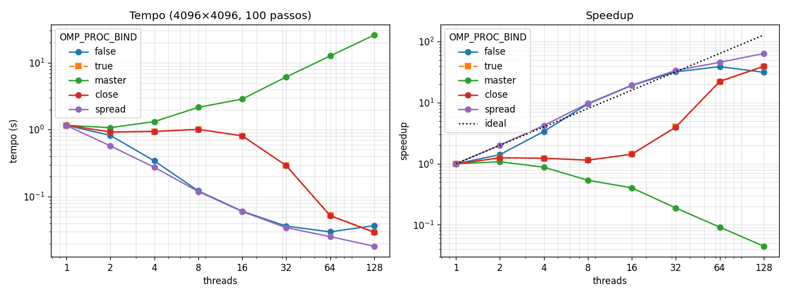

# Tarefa 13: Avaliação da Escalabilidade com Afinidade de Threads

## Objetivo
Avalie como a escalabilidade do seu código de Navier-Stokes muda ao utilizar os diversos tipos de afinidades de threads suportados pelo sistema operacional e pelo OpenMP no mesmo nó de computação do NPAD que utilizou para a tarefa 12.

---
## Arquivos

| Arquivo | Conteúdo |
|---|---|
| `fluid.c` | Navier-Stokes da Tarefa 12 (versão final v4: first touch paralelo e uma só região paralela) |
| `job.sh` | Job SLURM: grade 4096×4096, 100 passos, 5 políticas × 1 a 128 threads, 3 repetições |
| `resultados.csv` / `slurm-2127798.out` | Medições e saída do job usado no relatório |
| `diag.sh` / `diag-2127837.out` | Conferência com `OMP_DISPLAY_AFFINITY` de onde ficam as 128 threads em `close` e `spread` |
| `grafico.py` | Gera `img/afinidade.png` (menor tempo das 3 repetições) |
| `gera_relatorio.py` | Gera o relatório `Tarefa13_Afinidade_Threads.pdf` |
| `img/code.png` | Captura do `fluid.c` usada no relatório |

```bash
OMP_PROC_BIND=spread OMP_PLACES=cores OMP_NUM_THREADS=16 ./fluid 4096 100
sbatch job.sh                                    # no NPAD
python3 grafico.py && python3 gera_relatorio.py  # local
```

## Metodologia

O código é o da Tarefa 12 sem alterações no cálculo. A afinidade é escolhida só por variáveis de ambiente, como no slide:

- `OMP_PROC_BIND=false`: sem afinidade, o **sistema operacional** decide onde cada thread roda e pode migrá-la (o `OMP_PLACES` é ignorado).
- `OMP_PROC_BIND=true | master | close | spread` com `OMP_PLACES=cores`: cada thread fica presa a um núcleo físico, escolhido pela política do **OpenMP**.

Mesmo problema da escalabilidade forte da Tarefa 12: grade 4096×4096 (2 grades de 134 MB), 100 passos. Cada caso rodou 3 vezes; vale o menor tempo. Speedup em relação ao melhor tempo com 1 thread (1,16 s).

## Ambiente

NPAD/UFRN, partição `amd-512`, nó exclusivo `r2n09` (job 2127798), 2 × AMD EPYC 7713: 128 núcleos em 8 domínios NUMA de 16 núcleos (núcleos 0–15 no domínio 0, 16–31 no domínio 1, …). GCC 14.2.0, `-O3 -march=native -fopenmp`. O nó da Tarefa 12 (`r2n21`) estava em manutenção (*draining*), então foi usado outro nó `amd-512`, com o mesmo hardware.

## Resultados



Tempo em segundos (entre parênteses, o speedup):

| Threads | false (SO) | true | master | close | spread |
|---|---|---|---|---|---|
| 1 | 1,163 (1,0×) | 1,158 (1,0×) | 1,163 (1,0×) | 1,170 (1,0×) | 1,160 (1,0×) |
| 2 | 0,823 (1,4×) | 0,926 (1,3×) | 1,074 (1,1×) | 0,926 (1,3×) | 0,574 (2,0×) |
| 4 | 0,342 (3,4×) | 0,941 (1,2×) | 1,321 (0,9×) | 0,942 (1,2×) | 0,275 (4,2×) |
| 8 | 0,122 (9,5×) | 1,013 (1,1×) | 2,159 (0,5×) | 1,012 (1,1×) | 0,119 (9,7×) |
| 16 | 0,061 (19,1×) | 0,807 (1,4×) | 2,872 (0,4×) | 0,811 (1,4×) | 0,060 (19,3×) |
| 32 | 0,036 (32,0×) | 0,289 (4,0×) | 6,143 (0,2×) | 0,291 (4,0×) | 0,034 (33,6×) |
| 64 | 0,030 (38,9×) | 0,053 (22,0×) | 12,65 (0,09×) | 0,052 (22,4×) | 0,025 (45,8×) |
| 128 | 0,037 (31,4×) | 0,030 (39,0×) | 25,98 (0,04×) | 0,029 (39,5×) | **0,018 (63,8×)** |

## Análise

- **spread é a melhor em todos os casos.** Com `OMP_PLACES=cores`, as threads ficam espalhadas pelo nó: com 8 threads há uma em cada domínio NUMA. Como o stencil é limitado pela banda de memória, cada thread usa um controlador de memória diferente, e o first touch deixa as linhas de cada thread na memória do seu domínio. Com 8 e 16 threads o speedup passa do ideal (9,7× e 19,3×), porque as threads espalhadas somam o cache L3 de vários CCDs e as grades passam a caber quase inteiras em cache.
- **close (e true) quase não escala até 16 threads** (1,1× a 1,4×): as threads ficam em núcleos vizinhos (0, 1, 2, …), ou seja, todas no domínio NUMA 0, disputando a banda de memória de um só domínio. O ganho só aparece quando as threads passam para outros domínios: 4,0× com 32 (2 domínios), 22× com 64 (um socket inteiro). Com 128 threads, close e spread colocam a thread i no núcleo i (conferido com `OMP_DISPLAY_AFFINITY` em `diag-2127837.out`). A diferença restante (0,029 s contra 0,018 s) vem da variação entre execuções tão curtas: no job de conferência, close variou de 0,016 a 0,031 s.
- **true dá os mesmos tempos que close**: no GCC (libgomp), `true` usa a mesma distribuição de `close`.
- **master piora com mais threads**: todas ficam no núcleo da thread 0 e dividem um único núcleo, e cada thread a mais só acrescenta troca de contexto e sincronização (26 s com 128 threads, 22× mais lento que com 1).
- **false (SO) fica perto de spread até 32 threads**, porque o escalonador do Linux distribui as threads pelos núcleos livres. Com 64 e 128 threads fica pior (máximo de 38,9× com 64, e 31,4× com 128): sem afinidade, as threads podem migrar e se afastar da memória onde fizeram o first touch, e o SO também pode pôr duas threads nos dois hyperthreads de um mesmo núcleo (o nó expõe 256 CPUs lógicas).
- Comparação com a Tarefa 12, que usou `spread` + `cores`: lá a v4 chegou a 0,011 s (106,9×) com 128 threads no `r2n21`. Aqui foram 0,018 s no `r2n09` e 0,013–0,015 s no job de conferência. Com 128 threads cada execução dura só ~15 ms e varia bastante entre execuções e entre nós.

## Conclusão

Com o mesmo código e o mesmo nó, só a afinidade muda o speedup com 16 threads de 0,4× (master) a 1,4× (close) e 19,3× (spread). Como o Navier-Stokes é limitado pela banda de memória, a melhor escolha no nó NUMA do NPAD é espalhar as threads (`OMP_PROC_BIND=spread`, `OMP_PLACES=cores`): assim todos os controladores de memória são usados desde poucas threads e o first touch continua valendo. Deixar o SO decidir funciona bem até 32 threads, mas perde desempenho com o nó cheio, e close/true só se aproximam de spread quando todos os núcleos estão em uso.
