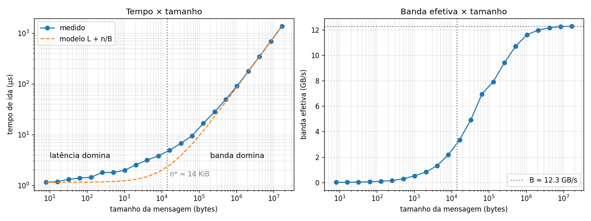

# Tarefa 14: Programação em memória distribuída

## Objetivo
Implemente um programa MPI com exatamente dois processos. O processo 0 deve enviar uma mensagem ao processo 1, que imediatamente responde com a mesma mensagem. Meça o tempo total de execução de múltiplas trocas consecutivas dessa mensagem, utilizando MPI_Wtime. Registre os tempos para diferentes tamanhos, desde mensagens pequenas (como 8 bytes) até mensagens maiores (como 1 MB ou mais). Analise o graficamente o tempo em função do tamanho da mensagem e identifique os regimes onde a latência domina e onde a largura de banda se torna o fator principal.

---
## Arquivos

| Arquivo | Conteúdo |
|---|---|
| `pingpong.c` | Ping-pong MPI (`MPI_Send`/`MPI_Recv`), 8 B até 16 MB, tempo com `MPI_Wtime` |
| `job.sh` | Job SLURM: 2 nós `amd-512`, 1 processo por nó (a mensagem passa pela rede) |
| `resultados.csv` | Medições (job 2117166, nós `r2n03` e `r2n04`) |
| `grafico.py` | Gera `pingpong.png` e ajusta o modelo `t(n) = L + n/B` |

```bash
sbatch job.sh          # no NPAD
python3 grafico.py     # local
```

Cada tamanho faz 10 trocas de aquecimento e depois 10 000 trocas (até 64 KB) ou 200 trocas (acima disso). Uma troca é ida e volta; o tempo de ida é metade dela.

## Resultado



| Tamanho | Tempo de ida | Banda efetiva |
|---|---|---|
| 8 B | 1,14 µs | 0,007 GB/s |
| 1 KB | 1,98 µs | 0,52 GB/s |
| 16 KB | 4,91 µs | 3,3 GB/s |
| 64 KB | 9,43 µs | 7,0 GB/s |
| 1 MB | 90,4 µs | 11,6 GB/s |
| 16 MB | 1366 µs | 12,3 GB/s |

Modelo `t(n) = L + n/B`:
- **Latência L ≈ 1,1 µs**: o tempo praticamente não muda de 8 B a ~512 B.
- **Banda B ≈ 12,3 GB/s**: a banda efetiva se estabiliza nesse valor a partir de ~2 MB (compatível com um enlace InfiniBand de 100 Gb/s).
- **Ponto de corte n\* = L·B ≈ 14 KB**: nesse tamanho a latência e o tempo de transferência pesam igual.

## Análise

- **Mensagens pequenas (até ~1 KB): a latência domina.** O tempo fica praticamente constante e a banda efetiva é pequena. Mandar 8 B ou 512 B custa quase o mesmo, então vale juntar várias mensagens pequenas numa só.
- **Mensagens médias (~1 KB a ~1 MB): transição.** O tempo começa a crescer com `n`. Nessa faixa o tempo medido fica acima do modelo de duas retas, por causa de custos que o modelo não inclui: cópia para buffers internos e a troca do protocolo *eager* para *rendezvous* (com um handshake a mais) nas mensagens maiores.
- **Mensagens grandes (acima de ~1 MB): a largura de banda domina.** O tempo cresce linearmente com `n` (dobrar a mensagem dobra o tempo) e a latência fixa fica desprezível (menos de 1% do tempo em 1 MB).
