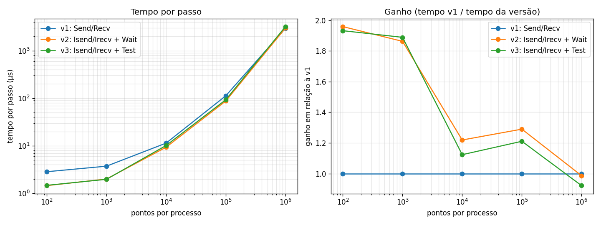

# Tarefa 15: Comunicação não bloqueante em MPI

## Objetivo
Implemente uma simulação da difusão de calor em uma barra 1D, dividida entre dois ou mais processos MPI. Cada processo deve simular um trecho da barra com células extras para troca de bordas com vizinhos. Implemente três versões: uma com MPI_Send/MPI_Recv, outra com MPI_Isend/MPI_Irecv e MPI_Wait, e uma terceira usando MPI_Test para atualizar os pontos internos enquanto aguarda a comunicação. Compare os tempos de execução e discuta os ganhos com sobreposição de comunicação e computação.

---
## Arquivos

| Arquivo | Conteúdo |
|---|---|
| `calor.c` | Difusão de calor 1D; a versão (1, 2 ou 3) é escolhida na linha de comando |
| `job.sh` | Job SLURM: 2 nós `amd-512`, 16 processos alternados entre os nós |
| `resultados.csv` | Medições (job 2127428, nós `r2n01` e `r2n02`, 3 repetições) |
| `grafico.py` | Gera `img/tempos.png` (menor tempo das 3 repetições) |
| `gera_relatorio.py` | Gera o relatório `Tarefa15_Difusao_Calor_MPI.pdf` |

```bash
mpirun -np 16 ./calor <versao> <pontos por processo> <passos>
sbatch job.sh                                    # no NPAD
python3 grafico.py && python3 gera_relatorio.py  # local
```

- **v1**: `MPI_Send`/`MPI_Recv` (pares enviam primeiro, ímpares recebem, depois invertem).
- **v2**: `MPI_Irecv`/`MPI_Isend`, atualiza os pontos internos, `MPI_Wait`, atualiza as bordas.
- **v3**: igual à v2, mas atualiza os pontos internos em blocos de 256 chamando `MPI_Test` entre eles.

Trabalho total fixo (pontos × passos = 10⁹). As três versões dão o mesmo resultado.

## Resultado



| Pontos/processo | v1 (µs/passo) | v2 (µs/passo) | v3 (µs/passo) |
|---|---|---|---|
| 100 | 2,86 | 1,46 | 1,48 |
| 1 000 | 3,74 | 2,01 | 1,98 |
| 10 000 | 11,4 | 9,37 | 10,2 |
| 100 000 | 113 | 87,5 | 93,2 |
| 1 000 000 | 2955 | 2995 | 3206 |

## Análise

- **Trechos pequenos: a comunicação domina.** As versões não bloqueantes são ~2× mais rápidas: na v1 a troca acontece em duas fases (duas latências por passo); na v2/v3 as quatro mensagens ficam em trânsito juntas (uma latência).
- **Trechos médios: a sobreposição aparece.** Com 1 000 pontos a conta (~0,9 µs) é da ordem da latência e parte dela fica escondida atrás dos pontos internos (2,0 µs medidos contra ~2,3 µs sem sobreposição). O ganho cai para ~1,2–1,3× à medida que a conta domina.
- **Trechos grandes: a computação domina** e as três versões empatam.
- **v2 × v3:** desempenho parecido. As mensagens (8 bytes) vão em modo *eager* e progridem sozinhas, então o `MPI_Test` não adianta nada e ainda custa as chamadas extras.
