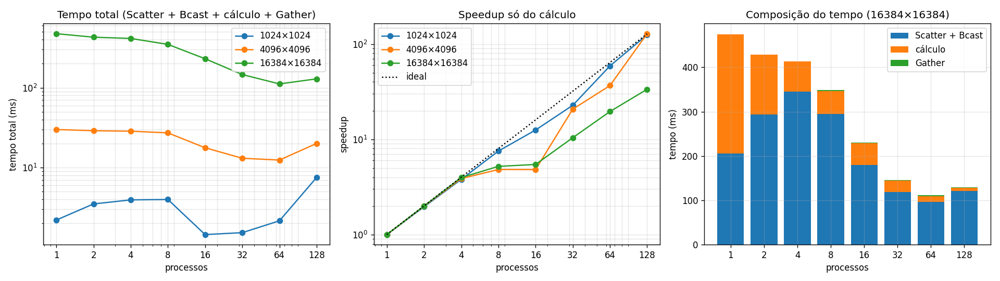

# Tarefa 16: Implementação de Produto Matriz-Vetor Usando MPI

## Objetivo
Implemente um programa MPI que calcule o produto y=A⋅x, onde A é uma matriz M×N e x é um vetor de tamanho N. Divida a matriz A por linhas entre os processos com MPI_Scatter, e distribua o vetor x inteiro com MPI_Bcast. Cada processo deve calcular os elementos de y correspondentes às suas linhas e enviá-los de volta ao processo 0 com MPI_Gather. Compare os tempos com diferentes tamanhos de matriz e número de processos.

---
## Arquivos

| Arquivo | Conteúdo |
|---|---|
| `mxv.c` | Produto matriz-vetor com `MPI_Scatter`, `MPI_Bcast` e `MPI_Gather` |
| `job.sh` | Job SLURM: 1 nó `amd-512`, matrizes de 1024 a 16384, de 1 a 128 processos |
| `resultados.csv` | Medições (3 repetições de cada caso) |
| `slurm-2127793.out` | Saída do job usado no relatório |
| `grafico.py` | Gera `img/tempos.png` (menor tempo total das 3 repetições) |
| `gera_relatorio.py` | Gera o relatório `Tarefa16_Matriz_Vetor_MPI.pdf` |
| `img/code.png` | Captura do `mxv.c` usada no relatório |

```bash
mpirun -np P ./mxv <M> <N>                       # M múltiplo de P
sbatch job.sh                                    # no NPAD
python3 grafico.py && python3 gera_relatorio.py  # local
```

## Implementação

- O processo 0 cria A (`A[i][j] = i + j`) e x (tudo 1).
- `MPI_Scatter` entrega M/P linhas consecutivas de A a cada processo; `MPI_Bcast` entrega x inteiro.
- Cada processo calcula as M/P posições de y das suas linhas.
- `MPI_Gather` junta os pedaços de y no processo 0, que confere cada `y[i]` com o valor exato `N·i + N(N−1)/2` (0 erros em todas as execuções).

O processo 0 mede com `MPI_Wtime` a **distribuição** (Scatter + Bcast), o **cálculo** das suas linhas e a **coleta** (Gather).

## Ambiente

NPAD/UFRN, partição `amd-512`, nó `r2n09` (job 2127793), 2 × AMD EPYC 7713 (128 núcleos). OpenMPI 5.0.10 e GCC 14.2.0 (`mpicc -O2`). Todos os processos no mesmo nó.

## Resultados



Tempo total em ms (entre parênteses, o speedup em relação a 1 processo):

| Processos | 1024×1024 | 4096×4096 | 16384×16384 |
|---|---|---|---|
| 1 | 2,21 | 30,0 | 475 |
| 2 | 3,51 (0,63×) | 29,0 (1,04×) | 429 (1,11×) |
| 4 | 3,94 (0,56×) | 28,6 (1,05×) | 414 (1,15×) |
| 8 | 3,99 (0,55×) | 27,2 (1,10×) | 349 (1,36×) |
| 16 | 1,45 (1,52×) | 17,7 (1,69×) | 231 (2,06×) |
| 32 | 1,53 (1,44×) | 13,1 (2,29×) | 146 (3,25×) |
| 64 | 2,16 (1,02×) | 12,4 (2,41×) | 112 (4,25×) |
| 128 | 7,54 (0,29×) | 20,1 (1,49×) | 129 (3,68×) |

Na matriz 16384×16384: distribuição 206 ms e cálculo 269 ms com 1 processo; distribuição 120 ms e cálculo 8,0 ms com 128.

## Análise

- **O cálculo escala bem:** 269 ms → 8,0 ms de 1 para 128 processos na maior matriz (34×), e perto do ideal na de 1024×1024. Entre 8 e 16 processos o cálculo quase não caiu nas duas matrizes maiores, provavelmente pelo posicionamento dos processos nos domínios NUMA (não investigado).
- **A distribuição domina o tempo total:** o produto faz só 2 operações por elemento de A, mas cada elemento sai do processo 0 pelo `MPI_Scatter`. Na maior matriz ela é 43% do tempo com 1 processo e 93% com 128, e por isso o speedup total fica em no máximo 4,25× (64 processos).
- **A distribuição cai com mais processos** (345 ms com 4 → 96 ms com 64): no mesmo nó, cada processo copia o seu bloco da memória do processo 0, e essas cópias acontecem em paralelo.
- **Matrizes pequenas não compensam:** na de 1024×1024 o cálculo leva ~1 ms, da ordem do custo das coletivas; com 2 a 8 processos fica mais lento que com 1, e o melhor caso é 1,5×.
- **Com 128 processos o tempo volta a subir** nos três tamanhos: o cálculo por processo já é pequeno, e as coletivas com mais participantes ficam mais caras. A coleta é sempre pequena (até ~1 ms), porque y tem só M valores.

## Conclusão

A divisão por linhas com `MPI_Scatter`, `MPI_Bcast` e `MPI_Gather` dá o resultado correto e o cálculo escala quase linearmente, mas o tempo total é dominado por espalhar a matriz a partir do processo 0: o produto matriz-vetor faz pouca conta por dado transferido. O ganho só aparece em matrizes grandes e com um número moderado de processos (até 4,3× com 64 processos na maior matriz).
