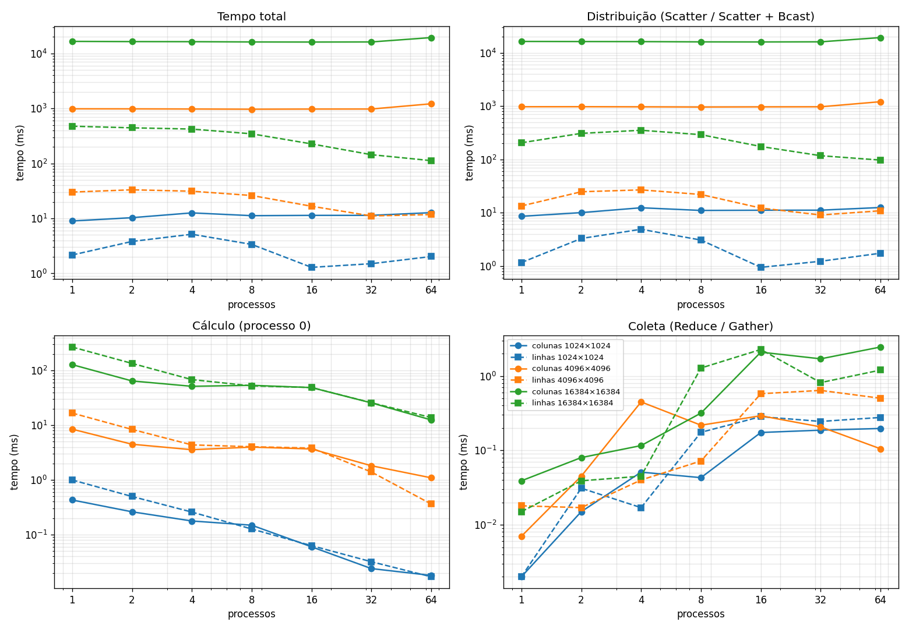

# Tarefa 17: Tipos Derivados em MPI

## Objetivo
Reimplemente a tarefa 16, agora distribuindo as colunas entre os processos. Utilize MPI_Type_vector e MPI_Type_create_resized para definir um tipo derivado que represente colunas da matriz. Use MPI_Scatter com esse tipo para distribuir blocos de colunas, e MPI_Scatter ou cópia manual para enviar os segmentos correspondentes de x. Cada processo deve calcular uma contribuição parcial para todos os elementos de y e usar MPI_Reduce com MPI_SUM para somar os vetores parciais no processo 0. Discuta as diferenças de acesso à memória e desempenho em relação à distribuição por linhas.

---
## Arquivos

| Arquivo | Conteúdo |
|---|---|
| `mxv.c` | Produto matriz-vetor por colunas: `MPI_Type_vector` + `MPI_Type_create_resized`, `MPI_Scatter` e `MPI_Reduce` |
| `job.sh` | Job SLURM: 64 núcleos de um nó `amd-512`, matrizes de 1024 a 16384, de 1 a 64 processos; roda também a versão por linhas (`../tarefa16/mxv.c`) |
| `resultados.csv` | Medições das duas versões (3 repetições de cada caso) |
| `slurm-2135226.out` | Saída do job usado no relatório |
| `grafico.py` | Gera `img/tempos.png` (menor tempo total das 3 repetições) |
| `gera_relatorio.py` | Gera o relatório `Tarefa17_Matriz_Vetor_Colunas_MPI.pdf` |
| `img/code.png` | Captura do `mxv.c` usada no relatório |

```bash
mpirun -np P ./mxv <M> <N>                       # N múltiplo de P
sbatch job.sh                                    # no NPAD
python3 grafico.py && python3 gera_relatorio.py  # local
```

## Implementação

- O processo 0 cria A por linhas (`A[i][j] = i + j`) e x (tudo 1).
- Tipo coluna: `MPI_Type_vector(M, 1, N, MPI_DOUBLE)` (M elementos separados por N) redimensionado com `MPI_Type_create_resized` para extent de 1 `double`, de modo que a coluna seguinte comece no elemento seguinte.
- `MPI_Scatter(A, N/P, coluna, ...)` entrega N/P colunas a cada processo, recebidas contíguas (`a[j*M + i]`); outro `MPI_Scatter` entrega os N/P valores de x correspondentes.
- Cada processo calcula um y parcial de tamanho M, e `MPI_Reduce` com `MPI_SUM` soma tudo no processo 0, que confere `y[i] = N·i + N(N−1)/2` (0 erros em todas as execuções).

O processo 0 mede com `MPI_Wtime` a **distribuição** (os dois Scatter), o **cálculo** e a **coleta** (Reduce).

## Ambiente

NPAD/UFRN, partição `amd-512`, nó `r2n16` (job 2135226), 2 × AMD EPYC 7713. OpenMPI 5.0.10 e GCC 14.2.0 (`mpicc -O2`). Sem `--exclusive` (a fila para o nó inteiro estava em dias), com `--hint=compute_bound` para 64 núcleos físicos; por isso vai só até 64 processos. A versão por linhas da tarefa 16 rodou no mesmo job.

## Resultados



Tempo de distribuição em ms, colunas × linhas:

| Processos | 1024 col. | 1024 lin. | 4096 col. | 4096 lin. | 16384 col. | 16384 lin. |
|---|---|---|---|---|---|---|
| 1 | 8,55 | 1,16 | 975 | 13,4 | 16.409 | 205 |
| 4 | 12,4 | 4,88 | 971 | 26,8 | 16.284 | 353 |
| 16 | 11,1 | 0,94 | 969 | 12,2 | 16.041 | 175 |
| 64 | 12,5 | 1,74 | 1.213 | 10,9 | 19.377 | 97 |

O cálculo e a coleta ficam parecidos nas duas versões (16384×16384 com 64 processos: cálculo 12,5 × 13,8 ms, coleta 2,5 × 1,2 ms).

## Análise

- **Distribuir colunas é muito mais caro:** na maior matriz, o Scatter por colunas leva 16,4 s contra 205 ms por linhas com 1 processo (80×) e 19,4 s contra 97 ms com 64 (199×). O tempo total não cai com mais processos.
- **Acesso à memória:** por linhas, cada bloco é contíguo e o Scatter é uma cópia sequencial (~10,5 GB/s). Por colunas, os elementos estão separados por N `double`s (128 KB na maior matriz); o MPI empacota elemento por elemento, cada leitura cai numa linha de cache (e página) diferente e só 8 dos 64 bytes são aproveitados (~131 MB/s). O tipo derivado tira o laço do programa, mas o laço continua dentro do MPI, feito só pelo processo 0 — por isso não melhora com mais processos.
- **O cálculo local é contíguo nas duas versões** e empata a partir de 8 processos; com 1 processo a versão por colunas é 2,1× mais rápida, porque `y[i] += a·x[j]` tem iterações independentes (vetorizável), enquanto o produto escalar por linhas acumula numa única soma.
- **Troca de x por y:** cada processo recebe só N/P valores de x, mas guarda um y parcial de M valores, e o Reduce combina P vetores de tamanho M; ainda assim a coleta leva poucos ms.

## Conclusão

`MPI_Type_vector` + `MPI_Type_create_resized` permitem espalhar colunas com um único `MPI_Scatter` e o `MPI_Reduce` dá o resultado correto, mas, com a matriz armazenada por linhas, ler colunas é um acesso espaçado que desperdiça a cache e deixa a distribuição de 3 a 200× mais lenta que por linhas. A divisão por colunas só compensaria com a matriz armazenada por colunas ou gerada por cada processo.
